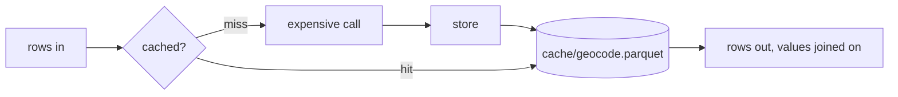

# dagster-run-cache

Caches expensive per-row work (embeddings, geocoding, image analysis) between
Dagster runs. Each table is one Parquet file, keyed by columns you choose, and
each run computes only the keys it has not seen. The files survive one
container per run and need no locking on a shared network mount.



## API

| Method | Does |
|---|---|
| `compute(table, frame, key, fn)` | runs `fn` on uncached keys only, stores the results, returns every row with its value |
| `lookup(table, frame, key)` | finds the rows not cached yet, with hit and miss counts |
| `store(table, frame, key)` | adds rows, replacing any with the same key |
| `fetch(table, frame, key)` | joins the cached columns onto a frame |
| `clear(table)` | deletes a table |

The examples below share one cache and a stand-in geocoder:

```python
import polars as pl
from dagster_run_cache import RunCache

cache = RunCache(base_dir="output/cache")
COORDS = {"Tokyo": (35.7, 139.7), "Paris": (48.9, 2.4), "Kyoto": (35.0, 135.8)}


def geocode(batch: pl.DataFrame) -> pl.DataFrame:
    return batch.with_columns(
        lat=pl.Series([COORDS[p][0] for p in batch["place"]]),
        lon=pl.Series([COORDS[p][1] for p in batch["place"]]),
    )
```

In a pipeline, register the resource once and request it by name:

```python
defs = dg.Definitions(assets=[...], resources={"cache": RunCache(base_dir="output/cache")})


@dg.asset
def place_geocodes(context, cache: RunCache, documents: pl.LazyFrame) -> pl.LazyFrame:
    result, lookup = cache.compute("geocode", documents.select("place").unique(), key="place", fn=geocode)
    context.add_output_metadata(lookup.metadata)
    return result
```

### `compute`

```python
places = pl.DataFrame({"doc_id": [1, 2, 3], "place": ["Tokyo", "Paris", "Tokyo"]})
result, lookup = cache.compute("geocode", places, key="place", fn=geocode)
# geocode is called once, with ["Tokyo", "Paris"]

result.collect()
# doc_id  place  lat   lon
# 1       Tokyo  35.7  139.7
# 2       Paris  48.9  2.4
# 3       Tokyo  35.7  139.7

lookup.hit_count, lookup.miss_count  # (0, 2)

result, lookup = cache.compute("geocode", pl.DataFrame({"place": ["Tokyo", "Kyoto"]}), key="place", fn=geocode)
# geocode is called with ["Kyoto"] only
lookup.hit_count, lookup.miss_count  # (1, 1)
```

`fn` receives the uncached keys, one row each, with only the key columns. It
returns those keys plus the columns to cache, as typed Polars columns (a vector
stays `Array(Float32, n)`). `compute` raises if `fn` leaves out a key or a key
column, or returns a column the input already has.

The counts are distinct keys, not rows: Tokyo appears twice above but is one
miss.

Pass `batch_size` for long jobs. Each batch is stored as it finishes, so a
first run that fails at row 140,000 keeps what it finished. Keep batches in the
thousands, since every store rewrites the file.

```python
result, lookup = cache.compute("geocode", places, key="place", fn=geocode, batch_size=5_000)
```

### `lookup`

```python
lookup = cache.lookup("geocode", pl.DataFrame({"place": ["Tokyo", "Lima"]}), key="place")

lookup.misses  # place: ["Lima"]
lookup.metadata  # {"cache/geocode/hits": 1, "cache/geocode/misses": 1}
```

`lookup.misses` keeps every column of the input, not only the key. Use it with
`store` and `fetch` when `fn` needs columns that are not in the key (see
`embed_by_id` under Keys), or when you want to call the expensive service
yourself.

### `store`

```python
cache.store("geocode", pl.DataFrame({"place": ["Lima"], "lat": [-12.0], "lon": [-77.0]}), key="place")
```

A row whose key is already cached replaces the old one. The columns must match
what the table already holds; see Limits.

### `fetch`

```python
cache.fetch("geocode", pl.DataFrame({"place": ["Lima", "Oslo"]}), key="place").collect()
# place  lat    lon
# Lima   -12.0  -77.0
```

Oslo is not cached, so it drops out. `fetch` returns a `LazyFrame`.

### `clear`

```python
cache.clear("geocode")  # 4, the rows it held
```

### Keys

A key is one or more columns, and it decides when a value is recomputed: a
changed key misses, an unchanged one hits. There is no other invalidation.

| Table | Key | A new key when |
|---|---|---|
| `geocode` | `place` | a new place appears |
| `embed` | `model`, `text` | the text is edited, or the model changes |
| `embed_by_id` | `model`, `doc_id`, `modified` | the record is edited, or the model changes |
| `image` | `file_name`, `file_date` | the file is replaced |

Either put the inputs themselves in the key (`embed`), or an id plus something
that changes whenever they do (`embed_by_id`). An id alone never changes, so an
edited record would keep its old value for good.

The id form keeps the text out of the cache file. Its `fn` still needs the
text, which `compute` would not pass, so `embed_by_id` calls `lookup`, `store`
and `fetch` itself; the misses from `lookup` carry every input column.

A null key raises, since a join never matches it.

### When to use it

An asset that only needs its own previous output can load that through its IO
manager and diff against it (`context.load_asset_value` on its own key), with no
extra resource. Use `RunCache` when that is not enough: a table several assets
share, or rows worth keeping after they leave the current input, such as
vectors for a model you might roll back to.

## As an IO manager instead

The same logic is also packaged as `CachedParquetIOManager`, a subclass of
dagster-polars' `PolarsParquetIOManager`. Here the asset's own output is the
cache: the asset returns only the rows it computed this run, and the IO manager
merges them into what it stored before.

```python
from dagster_run_cache.utils.cached_io_manager import CachedParquetIOManager, uncached

defs = dg.Definitions(
    assets=[...],
    resources={"cached_io_manager": CachedParquetIOManager(base_dir="output")},
)


@dg.asset(io_manager_key="cached_io_manager", metadata={"cache_key": ["model", "text"]})
def embedding_cache(context, documents: pl.LazyFrame) -> pl.DataFrame:
    lookup = uncached(context, texts(documents))  # rows this asset has not stored yet
    context.add_output_metadata(lookup.metadata)
    return embed(lookup.misses)  # merged into the stored table


@dg.asset
def doc_embeddings(documents: pl.LazyFrame, embedding_cache: pl.LazyFrame) -> pl.LazyFrame:
    return texts(documents).join(embedding_cache, on=["model", "text"])
```

| | `RunCache` resource | `CachedParquetIOManager` |
|---|---|---|
| Where the cache lives | a file per table under `base_dir` | the asset's own output, beside every other asset |
| Shows in the Dagster UI | as metadata on the asset that uses it | as an asset, with lineage and materialisations |
| Paths and S3 | local or mounted paths only | inherited from dagster-polars |
| One table for several assets | yes | no: one cache per asset |
| Saving progress per batch | yes (`batch_size`) | no: the IO manager writes once the asset returns |
| Asset code | one `compute` call returns the joined result | the cache asset returns new rows; a downstream asset joins |

Prefer the IO manager when one asset owns the cache and the work fits in a
single run. Prefer the resource for a table several assets share, or a first
backfill long enough that losing it partway would hurt.

## Demo

Five cached assets against one fake source (`src/dagster_run_cache/defs.py`).
The services in `fakes.py` sleep to stand in for latency. Four use the
resource, one per table under Keys: `doc_embeddings_by_id` runs the three steps
itself, the rest use `compute`. `embedding_cache` is the IO-manager version of
`doc_embeddings`, and `doc_embeddings_via_io` joins it onto the documents.

```sh
uv sync
uv run python scripts/demo.py
```

Four runs, each on a fresh ephemeral Dagster instance, so only the cache
directory carries over:

```
Run 1: first run, empty cache…
  place_geocodes        hits     0  misses    12
  doc_embeddings        hits     0  misses  1000
  doc_embeddings_by_id  hits     0  misses  1000
  embedding_cache       hits     0  misses  1000
  image_analysis        hits     0  misses  1000
  total time            11.57s

Run 2: nothing changed…
  place_geocodes        hits    12  misses     0
  doc_embeddings        hits  1000  misses     0
  doc_embeddings_by_id  hits  1000  misses     0
  embedding_cache       hits  1000  misses     0
  image_analysis        hits  1000  misses     0
  total time            0.23s

Run 3: source edited: 10 retitled, 3 re-photographed, 5 deleted, 5 added in a new place…
  place_geocodes        hits    12  misses     1
  doc_embeddings        hits   985  misses    15
  doc_embeddings_by_id  hits   985  misses    15
  embedding_cache       hits   985  misses    15
  image_analysis        hits   992  misses     8
  total time            0.42s

Run 4: embedding model bumped…
  place_geocodes        hits    13  misses     0
  doc_embeddings        hits     0  misses  1000
  doc_embeddings_by_id  hits     0  misses  1000
  embedding_cache       hits     0  misses  1000
  image_analysis        hits  1000  misses     0
  total time            6.71s
```

The resource's cache directory after the runs holds one file per table:
`embed.parquet`, `embed_by_id.parquet`, `geocode.parquet` and `image.parquet`.
The IO-manager cache is `embedding_cache.parquet`, beside the other asset
outputs.

To browse the assets in the Dagster UI instead:

```sh
uv run dg dev
```

## Limits

- **Stale rows:** an old model's embeddings or an edited document's old vector
  stay on disk until `clear()`, though nothing reads them again.
- **Every store rewrites the file:** appending to Parquet in place means
  rewriting its footer, which is fiddly and unsafe to interrupt. A store
  instead streams old and new rows into a temp file that replaces the
  original. For 150K 384-dimension vectors that is about 230MB: seconds
  locally, up to half a minute on NFS. A run with no misses writes nothing.
- **Concurrent stores:** two runs storing to one table at once both succeed,
  but the later drops the other's new rows. That costs a recompute, never a
  corrupt file. To rule it out, put the assets that share a table in one
  Dagster concurrency pool (a `dagster/concurrency_key` tag with `limit: 1`).
- **Stale file handles on NFS:** a run reading a table while another replaces
  it can fail with `ESTALE` on NFS, which keeps no old copy for other clients.
  The concurrency pool above prevents that too.
- **Fixed columns per table:** a different column order or a widening cast
  (`Int32` to `Int64`) is absorbed. Different column names, or values that
  will not cast to the stored dtypes, raise; `clear(table)` starts afresh.
- **No expiry:** put whatever should trigger a refresh into the key.
- **Rename atomicity on the mount:** writes rely on `os.replace` being atomic,
  which holds on local filesystems and NFS. Object stores such as S3 have no
  rename, so `RunCache`'s `base_dir` must be a local or mounted path. The IO
  manager renames through UPath, which on S3 is a copy then a delete: it works,
  but a crash between the two can leave the temp file behind.
- Polars is pinned below 2.0 until dagster-polars supports it.

## Why not a library, or Dagster's own pattern

Dagster's [resource-caching guide](https://dagster.io/docs/examples/best-practices/resource-caching#solution-2-external-caching)
suggests a resource that pickles one dict of results to a file. `RunCache` has
the same shape, but that version rewrites the whole cache on every save, looks
up one key per call, and states that it "assumes that all assets execute on the
same node"; for anything else the guide points to Redis or DynamoDB.

Key-value caches (`diskcache`, `dogpile.cache`, `cachetools`) fetch one key at
a time, and pipeline work arrives as frames, so a lookup there is thousands of
reads where a join is one. `diskcache` and dogpile's file backend also lock
through SQLite or dbm, which is unreliable on NFS. A dedicated vector store
such as LanceDB adds an index this pipeline does not query.

## Development

```sh
uv run ruff format . && uv run ruff check . && uv run mypy src && uv run pytest
lefthook install
```
