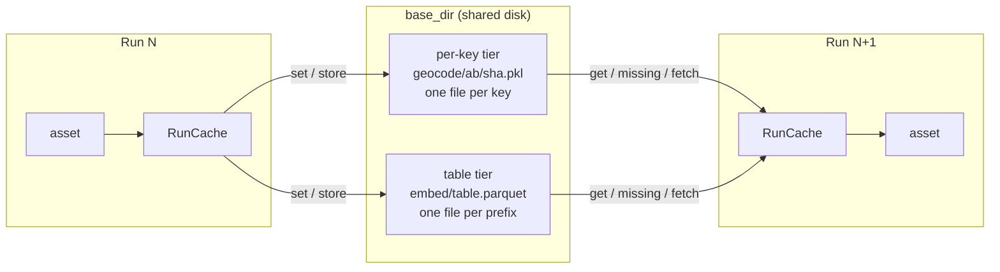

# dagster-run-cache

A Redis-style cache for Dagster that persists between runs.

Assets call `get`, `set`, `has` and friends on a `RunCache` resource. Entries
live in files under a directory, so the cache survives one container per run
and works on a shared network mount with nothing to lock.



## Two tiers

| | Per-key | Table |
|---|---|---|
| Use for | one item at a time: an HTTP lookup, a file analysis | bulk work over thousands of rows: embeddings |
| Calls | `get`, `set`, `has`, `delete`, `add`, `get_or_set`, `get_many`, `set_many` | `missing`, `store`, `fetch` |
| On disk | `<prefix>/<sha[:2]>/<sha>.pkl`, one file per key | `<prefix>/table.parquet`, one file per prefix |
| Values | any picklable Python value | typed Polars columns, e.g. `Array(Float32, n)` |
| TTL | yes | no |

Both tiers share `clear(prefix)` and `take_stats()`.

### Per-key

```python
cache.get("geocode:Tokyo", default=None)
cache.set("geocode:Tokyo", (35.7, 139.7), ttl=timedelta(days=30))
cache.has("geocode:Tokyo")
cache.delete("geocode:Tokyo")
cache.add("geocode:Tokyo", value)  # only if absent
cache.get_or_set("geocode:Tokyo", lambda: geocode("Tokyo"))
cache.get_many(keys)  # hits only
cache.set_many({key: value})
```

Values are pickled and zlib-compressed, as Django's file cache does. Two
consequences:

- Only the pipeline should be able to write to `base_dir`. Loading a pickle
  can run code.
- A class must still be importable when its value is read. An entry that no
  longer unpickles reads as a miss and is recomputed.

### Table

```python
misses = cache.missing("embed", docs, key="cache_key")  # rows not cached yet, one join
cache.store("embed", embed(misses), key="cache_key")  # add them, replacing equal keys
result = cache.fetch("embed", docs, key="cache_key")  # every row with its cached columns
```

A lookup is one Parquet scan and join rather than a file read per key. `store`
streams the existing table and the new rows into a temp file that then
replaces the table, so memory stays bounded and a reader never sees half a
file.

### Keys

Keys follow the Redis `prefix:rest` convention, and the prefix is a directory
on disk, so `clear("embed")` drops every embedding and leaves the rest.

A short natural key reads best where one exists: `f"geocode:{place}"`.
Where the inputs are long or several, `content_key` hashes them:

```python
content_key("embed", model, text)  # "embed:9f2c…"
```

Any change to any part gives a new key, so invalidation needs no code: a
retitled document or a new model simply misses.

### Setup

Register the resource once and request it by name in any asset:

```python
defs = dg.Definitions(assets=[...], resources={"cache": RunCache(base_dir="output/cache")})


@dg.asset
def place_geocodes(cache: RunCache, documents: pl.LazyFrame) -> pl.DataFrame: ...
```

## Demo

Three assets each show one pattern against the same fake source
(`src/dagster_run_cache/defs.py`). The services in `fakes.py` sleep to stand
in for latency.

| Asset | Pattern | Key |
|---|---|---|
| `place_geocodes` | per-key `get_or_set` | `geocode:{place}` |
| `doc_embeddings` | table: `missing`, batch the misses to the endpoint, `store`, `fetch` | `content_key("embed", model, text)` |
| `image_analysis` | per-key `get`, compute on a miss, `set` with a TTL | `content_key("image", file_name, file_date)` |

```sh
uv sync
uv run python scripts/demo.py
```

Four runs, each on a fresh ephemeral Dagster instance, so only the cache
directory carries over:

```
Run 1: first run, empty cache…
  place_geocodes   hits     0  misses    12
  doc_embeddings   hits     0  misses  1000
  image_analysis   hits     0  misses  1000
  total time       8.24s

Run 2: nothing changed…
  place_geocodes   hits    12  misses     0
  doc_embeddings   hits  1000  misses     0
  image_analysis   hits  1000  misses     0
  total time       0.16s

Run 3: source edited: 10 retitled, 3 re-photographed, 5 deleted, 5 added in a new place…
  place_geocodes   hits    12  misses     1
  doc_embeddings   hits   985  misses    15
  image_analysis   hits   992  misses     8
  total time       0.28s

Run 4: embedding model bumped…
  place_geocodes   hits    13  misses     0
  doc_embeddings   hits     0  misses  1000
  image_analysis   hits  1000  misses     0
  total time       2.23s
```

To browse the assets in the Dagster UI instead:

```sh
uv run dagster dev -m dagster_run_cache.defs
```

## Limits

- **Stale entries stay** until `clear()` or their TTL. An old model's
  embeddings take disk space but are never read again.
- **Per-key at scale.** A cold run over 150K keys writes 150K small files:
  fine on local disk, slower on a network mount. Use the table tier for bulk.
- **Table stores rewrite the table.** A run with misses rewrites the whole
  file: around 230MB for 150K 384-dimension vectors, seconds locally and up to
  half a minute on NFS. A run with no misses writes nothing.
- **Concurrent writes.** Two runs storing to one table at once both succeed,
  but the later drops the other's new rows; `add` is not atomic either. Both
  cost a recompute, never a corrupt cache.
- **Table schema is fixed per prefix.** Storing different columns raises; call
  `clear(prefix)` to start afresh.
- **Rename atomicity on the mount.** Writes rely on `os.replace` being atomic,
  which holds on local filesystems and NFS. Check it on any other mount type.
- Polars is pinned below 2.0 until dagster-polars supports it.

## Why not a library

`diskcache` has nearly the per-key API but keeps its index in SQLite, whose
locking is unreliable on NFS. `dogpile.cache`'s file backend is dbm, with the
same problem, and its region setup adds more than it saves. `cachetools` is
in-memory only. A Parquet file cannot be appended to in place (fastparquet's
`append=True` rewrites the footer without atomicity), hence the
rewrite-and-rename. A Redis server or the Postgres Dagster already uses could
sit behind the same `RunCache` methods without changing any asset.

## Development

```sh
uv run ruff format . && uv run ruff check . && uv run mypy src && uv run pytest
lefthook install
```
