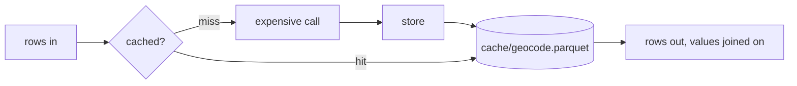

# dagster-run-cache

Caches expensive per-row work (embeddings, geocoding, image analysis) between
Dagster runs. Each table is one Parquet file, keyed by columns you choose, and
each run computes only the keys it has not seen. The files survive one
container per run and need no locking on a shared network mount.



## API

```python
from dagster_run_cache import RunCache

# One call: compute only the uncached keys, return every row with its value.
result, lookup = cache.compute("geocode", places, key="place", fn=geocode_batch)
context.add_output_metadata(lookup.metadata)  # cache/geocode/hits, cache/geocode/misses
return result  # a LazyFrame

# The same in three steps, when you need control over the expensive call.
lookup = cache.lookup("embed", docs, key=["model", "text"])
cache.store("embed", embed(lookup.misses), key=["model", "text"])
result = cache.fetch("embed", docs, key=["model", "text"])

cache.clear("embed")  # drop one table
```

`fn` receives the uncached keys, one row each, with only the key columns. It
returns those keys plus the columns to cache, as typed Polars columns (a vector
stays `Array(Float32, n)`). `compute` raises if `fn` leaves out a key or a key
column, or returns a column the input already has.

Pass `batch_size` to `compute` for long jobs. Each batch is stored as it
finishes, so a first run that fails at row 140,000 keeps what it finished.
Keep batches in the thousands, since every store rewrites the file.

`lookup.hit_count` and `lookup.miss_count` count distinct keys, not rows: five
documents sharing a place are one geocode.

Register the resource once and request it by name in any asset:

```python
defs = dg.Definitions(assets=[...], resources={"cache": RunCache(base_dir="output/cache")})


@dg.asset
def place_geocodes(context, cache: RunCache, documents: pl.LazyFrame) -> pl.LazyFrame: ...
```

### Keys

A key is one or more columns, and it decides when a value is recomputed: a
changed key misses, an unchanged one hits. There is no other invalidation.

| Table | Key | A new key when |
|---|---|---|
| `geocode` | `place` | a new place appears |
| `embed` | `model`, `text` | the text is edited, or the model changes |
| `embed_by_id` | `model`, `doc_id`, `modified` | the record is edited, or the model changes |
| `image` | `file_name`, `file_date` | the file is replaced |

Either put the inputs themselves in the key (`embed`), or an id plus something
that changes whenever they do (`embed_by_id`). An id alone never changes, so an
edited record would keep its old value for good.

The id form keeps the text out of the cache file. Its `fn` still needs the
text, which `compute` would not pass, so `embed_by_id` calls `lookup`, `store`
and `fetch` itself; the misses from `lookup` carry every input column.

A null key raises, since a join never matches it.

### When to use it

An asset that only needs its own previous output can load that through its IO
manager and diff against it (`context.load_asset_value` on its own key), with no
extra resource. Use `RunCache` when that is not enough: a table several assets
share, or rows worth keeping after they leave the current input, such as
vectors for a model you might roll back to.

## Demo

Four assets against one fake source (`src/dagster_run_cache/defs.py`), one per
table above. The services in `fakes.py` sleep to stand in for latency.
`doc_embeddings_by_id` runs the three steps itself; the rest use `compute`.

```sh
uv sync
uv run python scripts/demo.py
```

Four runs, each on a fresh ephemeral Dagster instance, so only the cache
directory carries over:

```
Run 1: first run, empty cache…
  place_geocodes        hits     0  misses    12
  doc_embeddings        hits     0  misses  1000
  doc_embeddings_by_id  hits     0  misses  1000
  image_analysis        hits     0  misses  1000
  total time            9.23s

Run 2: nothing changed…
  place_geocodes        hits    12  misses     0
  doc_embeddings        hits  1000  misses     0
  doc_embeddings_by_id  hits  1000  misses     0
  image_analysis        hits  1000  misses     0
  total time            0.13s

Run 3: source edited: 10 retitled, 3 re-photographed, 5 deleted, 5 added in a new place…
  place_geocodes        hits    12  misses     1
  doc_embeddings        hits   985  misses    15
  doc_embeddings_by_id  hits   985  misses    15
  image_analysis        hits   992  misses     8
  total time            0.29s

Run 4: embedding model bumped…
  place_geocodes        hits    13  misses     0
  doc_embeddings        hits     0  misses  1000
  doc_embeddings_by_id  hits     0  misses  1000
  image_analysis        hits  1000  misses     0
  total time            4.37s
```

The cache directory after the runs holds one file per table: `embed.parquet`,
`embed_by_id.parquet`, `geocode.parquet` and `image.parquet`.

To browse the assets in the Dagster UI instead:

```sh
uv run dagster dev -m dagster_run_cache.defs
```

## Limits

- **Stale rows:** an old model's embeddings or an edited document's old vector
  stay on disk until `clear()`, though nothing reads them again.
- **Every store rewrites the file:** appending to Parquet in place means
  rewriting its footer, which is fiddly and unsafe to interrupt. A store
  instead streams old and new rows into a temp file that replaces the
  original. For 150K 384-dimension vectors that is about 230MB: seconds
  locally, up to half a minute on NFS. A run with no misses writes nothing.
- **Concurrent stores:** two runs storing to one table at once both succeed,
  but the later drops the other's new rows. That costs a recompute, never a
  corrupt file. To rule it out, put the assets that share a table in one
  Dagster concurrency pool (a `dagster/concurrency_key` tag with `limit: 1`).
- **Stale file handles on NFS:** a run reading a table while another replaces
  it can fail with `ESTALE` on NFS, which keeps no old copy for other clients.
  The concurrency pool above prevents that too.
- **Fixed columns per table:** a different column order or a widening cast
  (`Int32` to `Int64`) is absorbed. Different column names, or values that
  will not cast to the stored dtypes, raise; `clear(table)` starts afresh.
- **No expiry:** put whatever should trigger a refresh into the key.
- **Rename atomicity on the mount:** writes rely on `os.replace` being atomic,
  which holds on local filesystems and NFS. Object stores such as S3 have no
  rename, so `base_dir` must be a local or mounted path.
- Polars is pinned below 2.0 until dagster-polars supports it.

## Why not a library

Key-value caches (`diskcache`, `dogpile.cache`, `cachetools`) fetch one key at
a time, and pipeline work arrives as frames, so a lookup there is thousands of
reads where a join is one. `diskcache` and dogpile's file backend also lock
through SQLite or dbm, which is unreliable on NFS. A dedicated vector store
such as LanceDB adds an index this pipeline does not query.

## Development

```sh
uv run ruff format . && uv run ruff check . && uv run mypy src && uv run pytest
lefthook install
```
