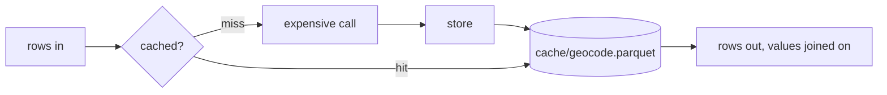

# dagster-run-cache

A cache of computed rows for Dagster that persists between runs.

Expensive per-row work (embeddings, geocoding, image analysis) is cached by
key in one Parquet file per table. Each run computes only the rows whose key
it has not seen before. The files survive one container per run and work on a
shared network mount with nothing to lock.



## API

```python
from dagster_run_cache import RunCache

# One call: compute only the uncached keys, return every row with its value.
result, lookup = cache.compute("geocode", places, key="place", fn=geocode_batch)
context.add_output_metadata(lookup.metadata)  # cache/geocode/hits, cache/geocode/misses
return result  # a LazyFrame

# The same in three steps, when you need control over the expensive call.
lookup = cache.lookup("embed", docs, key=["model", "text"])
cache.store("embed", embed(lookup.misses), key=["model", "text"])
result = cache.fetch("embed", docs, key=["model", "text"])

cache.clear("embed")  # drop one table
```

`fn` receives the uncached keys (the key columns only, one row per key) and
returns those keys plus the columns to cache. It must return a row for every
key; a dropped key, a missing key column, or a value column named like one of
the input's columns raises. Values are typed Polars columns, so vectors stay
`Array(Float32, n)`.

Pass `batch_size` to `compute` for long jobs. Each batch is stored as it
finishes, so a failure at row 140,000 of a first run keeps the batches already
done. Each store rewrites the file, so keep batches in the thousands.

`lookup.hit_count` and `lookup.miss_count` count distinct keys, not rows: five
documents sharing a place are one geocode.

Register the resource once and request it by name in any asset:

```python
defs = dg.Definitions(assets=[...], resources={"cache": RunCache(base_dir="output/cache")})


@dg.asset
def place_geocodes(context, cache: RunCache, documents: pl.LazyFrame) -> pl.LazyFrame: ...
```

### Keys

A key is one or more columns. Put every input that changes the result in it:

| Table | Key | A new key when |
|---|---|---|
| `geocode` | `place` | a new place appears |
| `embed` | `model`, `text` | the text is edited, or the model changes |
| `image` | `file_name`, `file_date` | the file is replaced |

There is no invalidation logic: a changed input is a new key, so it misses.
A null key raises, since a join never matches it.

### When to use it

An asset that only needs its own previous output can load that through its IO
manager and diff against it (`context.load_asset_value` on its own key), with no
extra resource. Use `RunCache` when that is not enough: a table several assets
share, or rows worth keeping after they leave the current input, such as
vectors for a model you might roll back to.

## Demo

Three assets against one fake source (`src/dagster_run_cache/defs.py`). The
services in `fakes.py` sleep to stand in for latency. `place_geocodes` and
`image_analysis` use `compute`; `doc_embeddings` runs the three steps itself, to
show what `compute` does.

```sh
uv sync
uv run python scripts/demo.py
```

Four runs, each on a fresh ephemeral Dagster instance, so only the cache
directory carries over:

```
Run 1: first run, empty cache…
  place_geocodes   hits     0  misses    12
  doc_embeddings   hits     0  misses  1000
  image_analysis   hits     0  misses  1000
  total time       7.39s

Run 2: nothing changed…
  place_geocodes   hits    12  misses     0
  doc_embeddings   hits  1000  misses     0
  image_analysis   hits  1000  misses     0
  total time       0.11s

Run 3: source edited: 10 retitled, 3 re-photographed, 5 deleted, 5 added in a new place…
  place_geocodes   hits    12  misses     1
  doc_embeddings   hits   985  misses    15
  image_analysis   hits   992  misses     8
  total time       0.23s

Run 4: embedding model bumped…
  place_geocodes   hits    13  misses     0
  doc_embeddings   hits     0  misses  1000
  image_analysis   hits  1000  misses     0
  total time       2.24s
```

The cache directory after the runs holds `embed.parquet`, `geocode.parquet`
and `image.parquet`.

To browse the assets in the Dagster UI instead:

```sh
uv run dagster dev -m dagster_run_cache.defs
```

## Limits

- **Stale rows stay** until `clear()`. An old model's embeddings or an edited
  document's old vector take disk space but are never read again.
- **A store rewrites the file.** Parquet cannot be appended to, so a store
  streams the old rows and the new into a temp file that replaces the
  original: around 230MB for 150K 384-dimension vectors, seconds locally and
  up to half a minute on NFS. A run with no misses writes nothing.
- **Concurrent stores:** two runs storing to one table at once both succeed,
  but the later drops the other's new rows. That costs a recompute, never a
  corrupt file. To rule it out, put the assets that share a table in one
  Dagster concurrency pool (a `dagster/concurrency_key` tag with `limit: 1`).
- **Stale file handles on NFS:** a run reading a table while another replaces
  it can fail with `ESTALE` on NFS, which keeps no old copy for other clients.
  The concurrency pool above prevents that too.
- **Columns are fixed per table.** Column order and widening casts (`Int32` to
  `Int64`) are absorbed; different column names, or values that will not cast
  to the stored dtypes, raise. Call `clear(table)` to start afresh.
- **No expiry:** put whatever should trigger a refresh into the key.
- **Rename atomicity on the mount:** writes rely on `os.replace` being atomic,
  which holds on local filesystems and NFS. Object stores such as S3 have no
  rename, so `base_dir` must be a local or mounted path.
- Polars is pinned below 2.0 until dagster-polars supports it.

## Why not a library

Key-value caches (`diskcache`, `dogpile.cache`, `cachetools`) fetch one key at
a time, and pipeline work arrives as frames, so a lookup there is thousands of
reads where a join is one. `diskcache` and dogpile's file backend also lock
through SQLite or dbm, which is unreliable on NFS. A dedicated vector store
such as LanceDB adds an index this pipeline does not query.

## Development

```sh
uv run ruff format . && uv run ruff check . && uv run mypy src && uv run pytest
lefthook install
```
