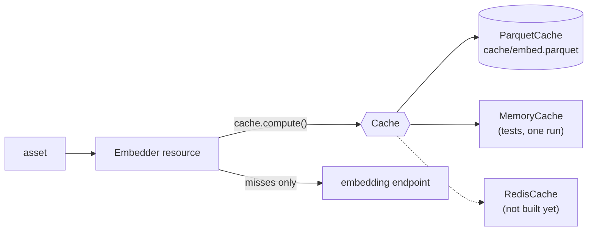

# dagster-run-cache

A cache interface for Dagster resources that persists between runs. A service
resource (an embedding client, a geocoder) holds a `Cache` and checks it before
every expensive call, so each run only pays for what it has not seen. The
backend is chosen per cache when the resources are wired, not in the code that
calls it.



## Backends

| Backend | Use for | Stored as |
|---|---|---|
| `ParquetCache(name, base_dir)` | bulk work on local or NFS storage, no infrastructure | one Parquet file, `<base_dir>/<name>.parquet` |
| `MemoryCache(name)` | tests, or anything that only needs to last one run | a dict on the resource instance |

Every backend answers the same calls. A Redis backend would only need `get_many`,
`set_many`, `delete` and `clear` (Redis `MGET`, `MSET`, `DEL`, a key scan).

## Per-key calls

```python
from dagster_run_cache import ParquetCache

cache = ParquetCache(name="geocode", base_dir="output/cache")

cache.get("Tokyo")  # None
cache.set("Tokyo", [35.7, 139.7])
cache.get("Tokyo")  # [35.7, 139.7]
cache.has("Tokyo")  # True
cache.set_many({"Paris": [48.9, 2.4], "Kyoto": [35.0, 135.8]})
cache.get_many(["Tokyo", "Lima"])  # {"Tokyo": [35.7, 139.7]}, misses left out
cache.delete("Kyoto")  # True
cache.clear()  # 2, the entries it held
```

On `ParquetCache` every write rewrites the file, so `set` in a loop suits a
small cache like this one. For thousands of keys use `set_many` or the frame
calls below. Values are anything Polars can store: numbers, strings, lists,
dicts.

## Frame calls

Pipeline work arrives as frames, and the nightly rebuild needs a value for every
row, so the frame calls look up a whole frame at once. `ParquetCache` answers
each with one join; other backends go through `get_many` / `set_many`.

| Call | Does |
|---|---|
| `compute(frame, key, fn)` | runs `fn` on uncached keys only, stores the results, returns every row with its value |
| `lookup(frame, key)` | finds the rows not cached yet, with hit and miss counts |
| `store(frame, key)` | adds rows, replacing any with the same key |
| `fetch(frame, key)` | joins the cached columns onto a frame |

```python
import polars as pl

places = ParquetCache(name="places", base_dir="output/cache")
COORDS = {"Tokyo": (35.7, 139.7), "Paris": (48.9, 2.4), "Kyoto": (35.0, 135.8)}


def geocode(batch: pl.DataFrame) -> pl.DataFrame:
    return batch.with_columns(
        lat=pl.Series([COORDS[p][0] for p in batch["place"]]),
        lon=pl.Series([COORDS[p][1] for p in batch["place"]]),
    )
```

### `compute`

```python
docs = pl.DataFrame({"doc_id": [1, 2, 3], "place": ["Tokyo", "Paris", "Tokyo"]})
result, lookup = places.compute(docs, key="place", fn=geocode)
# geocode is called once, with ["Tokyo", "Paris"]

result.collect()
# doc_id  place  lat   lon
# 1       Tokyo  35.7  139.7
# 2       Paris  48.9  2.4
# 3       Tokyo  35.7  139.7

lookup.hit_count, lookup.miss_count  # (0, 2)

result, lookup = places.compute(pl.DataFrame({"place": ["Tokyo", "Kyoto"]}), key="place", fn=geocode)
# geocode is called with ["Kyoto"] only
lookup.hit_count, lookup.miss_count  # (1, 1)
```

`fn` receives the uncached keys, one row each, with only the key columns. It
returns those keys plus the columns to cache. `compute` raises if `fn` leaves
out a key or a key column, or returns a column the input already has.

The counts are distinct keys, not rows: Tokyo appears twice above but is one
miss.

Pass `batch_size` for long jobs. Each batch is stored as it finishes, so a
first run that fails at row 140,000 keeps what it finished. Keep batches in the
thousands, since every store to a `ParquetCache` rewrites the file.

### `lookup`, `store`, `fetch`

`compute` is these three in a row. Call them yourself when `fn` needs columns
that are not in the key, since `lookup.misses` keeps every column of the input.

```python
lookup = places.lookup(pl.DataFrame({"place": ["Tokyo", "Lima"]}), key="place")
lookup.misses  # place: ["Lima"]
lookup.metadata  # {"cache/places/hits": 1, "cache/places/misses": 1}

places.store(pl.DataFrame({"place": ["Lima"], "lat": [-12.0], "lon": [-77.0]}), key="place")

places.fetch(pl.DataFrame({"place": ["Lima", "Oslo"]}), key="place").collect()
# place  lat    lon
# Lima   -12.0  -77.0       (Oslo is not cached, so it drops out)
```

`fetch` and `compute` return a `LazyFrame`. Pass `lookup.metadata` to
`context.add_output_metadata` to show hits and misses on the asset.

### Keys

A key is one or more columns, and it decides when a value is recomputed: a
changed key misses, an unchanged one hits. There is no other invalidation.

| Cache | Key | A new key when |
|---|---|---|
| `geocode` | the place | a new place appears |
| `embed` | `model`, `text` | the text is edited, or the model changes |
| `embed_by_id` | `model`, `doc_id`, `modified` | the record is edited, or the model changes |
| `image` | `file_name`, `file_date` | the file is replaced |

Either put the inputs themselves in the key (`embed`), or an id plus something
that changes whenever they do (`embed_by_id`). An id alone never changes, so an
edited record would keep its old value for good. The id form keeps the text out
of the cache file, but its `fn` needs the text, so it calls `lookup`, `store` and
`fetch` itself.

A null key raises, since a join never matches it.

## A cache inside a resource

Type a resource field as `Cache` and the backend is chosen in `Definitions`:

```python
from dagster_run_cache import Cache, Lookup, ParquetCache


class Embedder(dg.ConfigurableResource):
    model: str = "fake-embed-v1"
    cache: Cache

    def embed(self, frame: pl.LazyFrame) -> tuple[pl.LazyFrame, Lookup]:
        texts = frame.with_columns(model=pl.lit(self.model))
        return self.cache.compute(texts, key=["model", "text"], fn=self.vectors, batch_size=100)

    def vectors(self, batch: pl.DataFrame) -> pl.DataFrame: ...  # calls the endpoint


defs = dg.Definitions(
    assets=[doc_embeddings],
    resources={"embedder": Embedder(cache=ParquetCache(name="embed", base_dir="output/cache"))},
)


@dg.asset
def doc_embeddings(context, embedder: Embedder, documents: pl.LazyFrame) -> pl.LazyFrame:
    result, lookup = embedder.embed(texts(documents))
    context.add_output_metadata(lookup.metadata)
    return result
```

Every asset and resource that uses `embedder` gets the cache. Swapping the
backend, such as `MemoryCache` in tests, is a change to the wiring only.

### When to use it

An asset that only needs its own previous output can load that through its IO
manager and diff against it (`context.load_asset_value` on its own key), with no
extra resource. Reach for a `Cache` when the expensive call lives in a resource,
when several assets use one service, or when rows are worth keeping after they
leave the current input, such as vectors for a model you might roll back to.

## Demo

Four assets against one fake source (`src/dagster_run_cache/defs.py`). The
services in `fakes.py` sleep to stand in for latency.

| Asset | Shows |
|---|---|
| `place_geocodes` | a `Geocoder` resource calling `get` / `set` per place |
| `doc_embeddings` | an `Embedder` resource calling `compute`; the asset is one call |
| `doc_embeddings_by_id` | `lookup`, `store` and `fetch` in the asset, keyed by record |
| `image_analysis` | `compute` on a cache the asset requests directly |

```sh
uv sync
uv run python scripts/demo.py
```

Four runs, each on a fresh ephemeral Dagster instance, so only the cache
directory carries over:

```
Run 1: first run, empty cache…
  place_geocodes        hits     0  misses    12
  doc_embeddings        hits     0  misses  1000
  doc_embeddings_by_id  hits     0  misses  1000
  image_analysis        hits     0  misses  1000
  total time            9.57s

Run 2: nothing changed…
  place_geocodes        hits    12  misses     0
  doc_embeddings        hits  1000  misses     0
  doc_embeddings_by_id  hits  1000  misses     0
  image_analysis        hits  1000  misses     0
  total time            0.15s

Run 3: source edited: 10 retitled, 3 re-photographed, 5 deleted, 5 added in a new place…
  place_geocodes        hits    12  misses     1
  doc_embeddings        hits   985  misses    15
  doc_embeddings_by_id  hits   985  misses    15
  image_analysis        hits   992  misses     8
  total time            0.32s

Run 4: embedding model bumped…
  place_geocodes        hits    13  misses     0
  doc_embeddings        hits     0  misses  1000
  doc_embeddings_by_id  hits     0  misses  1000
  image_analysis        hits  1000  misses     0
  total time            4.46s
```

The cache directory after the runs holds one file per cache: `embed.parquet`,
`embed_by_id.parquet`, `geocode.parquet` and `image.parquet`.

To browse the assets in the Dagster UI instead:

```sh
uv run dg dev
```

## Limits

- **Stale entries:** an old model's embeddings or an edited document's old
  vector stay on disk until `clear()`, though nothing reads them again.
- **Every `ParquetCache` write rewrites the file:** appending to Parquet in
  place means rewriting its footer, which is fiddly and unsafe to interrupt. A
  write instead streams old and new rows into a temp file that replaces the
  original. For 150K 384-dimension vectors that is about 230MB: seconds
  locally, up to half a minute on NFS. A run with no misses writes nothing.
- **Concurrent writes:** two runs writing to one `ParquetCache` at once both
  succeed, but the later drops the other's new rows. That costs a recompute,
  never a corrupt file. To rule it out, put the assets that share a cache in
  one Dagster concurrency pool (a `dagster/concurrency_key` tag with
  `limit: 1`).
- **Stale file handles on NFS:** a run reading a cache while another replaces
  it can fail with `ESTALE` on NFS, which keeps no old copy for other clients.
  The concurrency pool above prevents that too.
- **Fixed columns per cache:** a different column order or a widening cast
  (`Int32` to `Int64`) is absorbed. Different column names, or values that
  will not cast to the stored dtypes, raise; `clear()` starts afresh. Use one
  style per cache, per-key or frame, since they store different columns.
- **No expiry:** put whatever should trigger a refresh into the key.
- **Paths:** `ParquetCache` writes through `os.replace`, which is atomic on local
  filesystems and NFS. Object stores such as S3 have no rename, so `base_dir`
  must be a local or mounted path.
- Polars is pinned below 2.0 until dagster-polars supports it.

## Why not a library, or Dagster's own pattern

Dagster's [resource-caching guide](https://dagster.io/docs/examples/best-practices/resource-caching#solution-2-external-caching)
suggests a resource that pickles one dict of results to a file. This repo keeps
that shape (the cache sits behind a resource) but that version rewrites the
whole cache on every save, looks up one key per call, and states that it
"assumes that all assets execute on the same node"; for anything else the
guide points to Redis or DynamoDB.

Key-value caches (`diskcache`, `dogpile.cache`, `cachetools`) fetch one key at a
time, where a frame lookup is one join. `diskcache` and dogpile's file backend
also lock through SQLite or dbm, which is unreliable on NFS. A dedicated vector
store such as LanceDB adds an index this pipeline does not query.

An IO manager that merges an asset's output into its previous output was also
prototyped. It gave lineage and S3 paths for free, but only one asset could use
each cache, nothing outside an asset could reach it, and it could not keep
progress between batches, so the resource pattern replaced it.

## Development

```sh
uv run ruff format . && uv run ruff check . && uv run mypy src && uv run pytest
lefthook install
```
